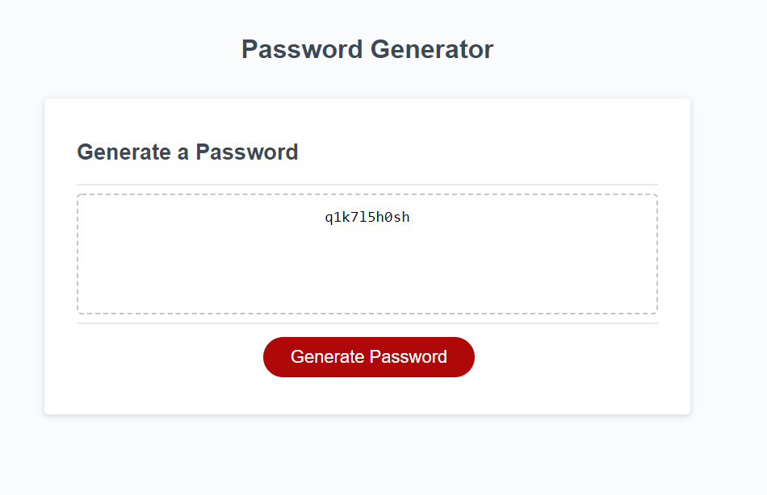
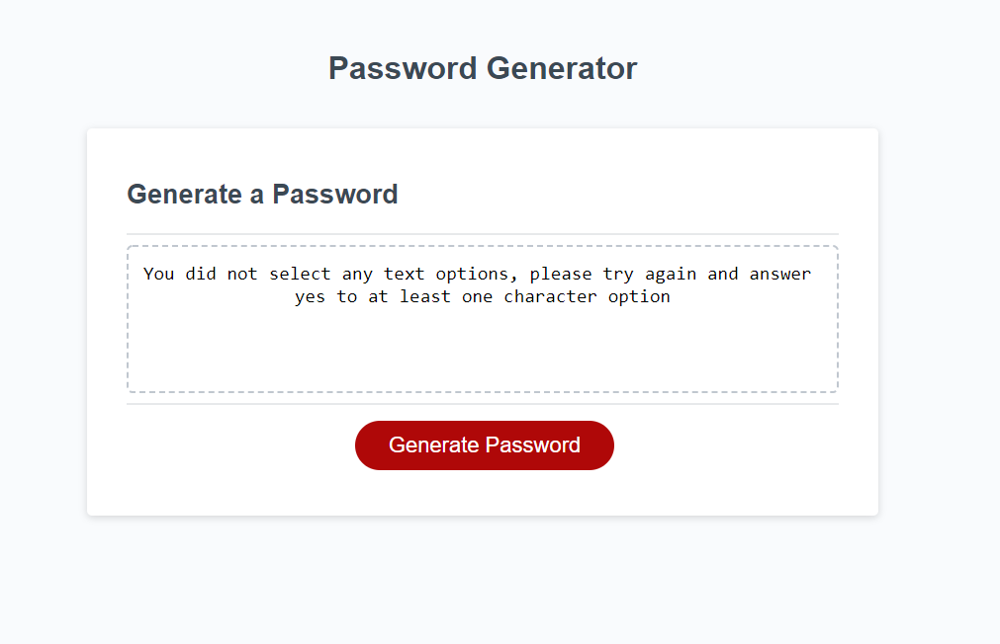

# Password Generator

Do you need a new password for your next account but have already exhausted all of your passwords you have thought of? Perhaps you simply want a more robust password that is harder to guess? This application is for you! Select a password length between 8 and 128 characters with options to select lowercase, uppercase, numeric, and special characters. The password generator will then randomly select a character from the arrays of characters that you have selected and present you a new, high-quality, secure password!

> Note that if you do not select any types of characters, you will receive an error message and must start over!

> Also note that the generator only reads for y to determine character selection, n or any other entry will return as a non selected character type

## My Motivations

Creating new passwords for websites can be a pain, especially with best practice security in mind to not repeat passwords and use different passwords for different sites. Thus, the password generator was born! I wanted an easy and convenient way to randomly generate new passwords similar to Chrome's password generator.

## Finished Product

An example password that has been generated with a length of 10 and both lowercase and numeric characters selected:

The screen that is displayed if no characters are selected:

### Credits and Contributions

- Used start code provided in class
